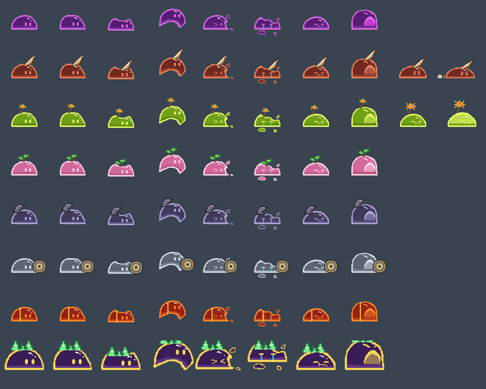

# Issue 80: 적 머리 위 상태 글자 제거와 돌진·폭발 예고 동작

- Issue: https://github.com/Apptive-Game-Team/WordVenture/issues/80
- Branch: `feat/enemy-windup-motion` (PR #71 `feat/act-two-complete` 위)

## 변경

- `Enemy`가 HP 숫자를 복제해 만들던 머리 위 글자(`ElementalStatusText`)를 없앤다. 반응 글자
  ("불꽃 방전", "쇄빙", "신경 마비", "용암 균열", "방패 보호", "회복")와 예고 글자("돌진 준비",
  "폭발 준비", "포격 조준")가 모두 사라진다. 그 글자의 글꼴만 들고 있던
  `ElementalStatusPresentation`도 지운다.
- 상태 이상은 지금처럼 몸 색과 `ElementalStatusVfx`로 보여 준다.
- 2부 적 슬라임 7종을 보라 원거리 슬라임 프레임에서 다시 그린다(`docs/design/act-two-art/build_slimes.py`).
  생성 그림은 눈 위치, 몸 모양, 테두리가 기존 슬라임과 달랐다. 색 4개만 바꾸고 장식을 얹어 기존 보스와 같은 방식으로 맞춘다.
- 돌진·폭발 슬라임에 예고 프레임 2장씩을 더하고 `SlimeAnimator.Windup`이 번갈아 보여 준다.
  - 돌진: 눈썹을 찌푸리고 웅크린다. 두 번째 장은 더 납작해지며 먼지가 인다. `WindupMotion`으로 0.4 unit 물러나 떤다.
  - 폭발: 눈을 찡그리고 심지 불꽃이 커진다. 두 번째 장은 몸이 번쩍이며 부푼다. 제자리에서 떤다.
- 곡사 슬라임과 최종 보스의 포격 예고는 기존 바닥 표시만 남는다.

## 검증

- PlayMode: 돌진 예고(예고 프레임, 물러남, 글자 없음, 피격 뒤 예고 프레임 복귀, 돌진 뒤 해제), 폭발 예고 프레임
- EditMode: 2부 적 prefab 프레임이 manifest(돌진·폭발 10장, 나머지 8장)와 같다
- EditMode·PlayMode 전체

## 미리보기

맨 윗줄은 기존 보라 원거리 슬라임이고, 그 아래는 돌진, 폭발, 치유, 곡사, 방패, 분열, 최종 보스 순서다. 돌진·폭발 줄의 9, 10번째 칸이 예고 프레임이다.
