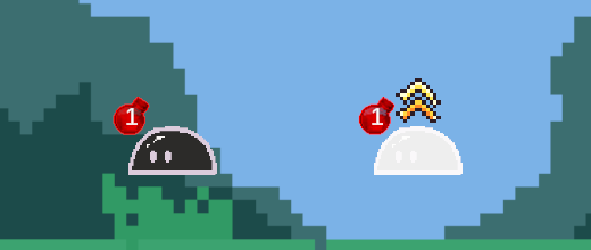
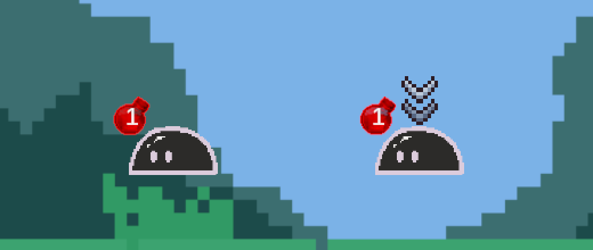

# Issue 93: 주문 명중 시 상성 아이콘과 타격 연출

- Issue: https://github.com/Apptive-Game-Team/WordVenture/issues/93
- Branch: `feat/hit-feedback`

## 범위

주문이 적에게 명중하는 순간에 연출 네 가지를 추가한다: 상성 아이콘, 히트스톱, 화면 흔들림,
피격 번쩍임과 넉백. 연출 세기는 실제로 적용된 상성 배율과 원소 반응 여부로 정한다.
데미지 숫자 팝업, 워드가 맞을 때의 연출, 화상 같은 지속 피해의 연출은 범위에 넣지 않는다.

## 규칙

- 명중 강도는 다섯 단계다. `HitImpact.Classify`가 정한다.
  - 적용 배율이 0 이하(신성의 회복)이면 `None`이고 연출을 재생하지 않는다.
  - 원소 반응이 일어나면 `Reaction`이다.
  - 배율이 1보다 크면 `Weak`, 1보다 작으면 `Resisted`, 1이면 `Normal`이다.
- 적용 배율은 `ElementalStatus.HitResult.Affinity`로 받는다. 균열이 저항을 무시하면 상성표
  값이 아니라 실제로 쓴 배율이 들어간다. 데미지 계산은 바꾸지 않는다.
- 상성 아이콘은 글자 없이 그림만 쓴다. 약점은 주황·노랑 위쪽 이중 화살촉과 반짝임, 저항은
  회색·파랑 아래쪽 이중 화살촉이다. 방패 모양은 방패 슬라임의 보호 효과(`Burst.Guard`)가
  이미 쓰고 있어서 쓰지 않는다. 원소 반응이 일어난 명중도 배율에 맞는 아이콘을 띄운다.
- 아이콘 그림은 `docs/design/combat-effects/build_affinity_marks.py`가
  `Assets/Resources/Combat/AffinityMark.png`로 만든다. 기존 `ReactionBurst.png`와 같은 방식이다.
- 히트스톱은 `Time.timeScale`을 0으로 두고 실제 시간으로 기다린다. 겹치면 끝나는 시각을
  늘리고, 씬을 나가면 1로 되돌린다.
- 화면 흔들림은 `Camera.main` 위치를 잠시 흔들고 원래 위치로 정확히 돌려놓는다.
- 번쩍임은 몸 sprite를 흰색으로 그리는 shader(`Resources/Combat/HitFlash.shader`)와
  material을 쓴다. `SpriteRenderer.color`로는 sprite를 원래보다 밝게 만들 수 없기 때문이다.
  material이 `Resources`에 있어서 WebGL 빌드에도 shader가 포함된다.
- 넉백은 위치에 더한 만큼 정확히 빼서 되돌린다. 적 턴의 `MoveDistance`도 위치를 조금씩
  더하므로, 위치를 덮어쓰면 이동이 어긋난다.

## 변경 파일

- `Scripts/Combat/HitImpact.cs` 신규: 강도 분류, 수치, 히트스톱, 화면 흔들림
- `Scripts/Combat/Enemies/HitFlashVfx.cs` 신규: 번쩍임, 넉백
- `Scripts/Combat/Enemies/AffinityMarkVfx.cs` 신규: 상성 아이콘
- `Resources/Combat/AffinityMark.png`, `HitFlash.shader`, `HitFlash.mat` 신규
- `docs/design/combat-effects/build_affinity_marks.py` 신규
- `Scripts/Combat/ElementalStatus.cs`: `HitResult.Affinity` 추가
- `Scripts/Combat/Enemies/Enemy.cs`: 연출 component 추가, `TakeSpellHit`에서 재생
- 테스트: EditMode `HitImpactTests`, `ElementalStatusTests`, PlayMode `HitImpactPlayTests`,
  `ElementalStatusPlayTests`

## 검증

- Unity 2022.3.34f1 batchmode로 Windows 쪽 프로젝트 사본(`C:\temp\wordventure-hit-feedback`)에서
  테스트를 실행했다.
  - EditMode: 158개 중 155개 통과, 2개 실패, 1개 건너뜀. 실패 2개는 `LocalizationTests`의 2부
    대사 영어 번역 누락이고, 변경 전 `develop`(146개 중 2개 실패)에서도 똑같이 실패한다.
  - PlayMode: 49개 중 48개 통과, 실패 0개, 1개 건너뜀.
- `ElementalStatusPlayTests`의 빙결 테스트는 위치를 정확히 같은지 비교했다. 넉백이 더한 만큼 빼서
  되돌리면 0.00000012 unit의 float 오차가 남아서, 오차 허용 범위 0.001을 줬다.
- batchmode 렌더링으로 TurnBattleScene에 슬라임을 놓고 번쩍임과 아이콘을 확인했다. 이때 shader
  구조체 이름이 `UnitySprites.cginc`의 `v2f`와 겹쳐 컴파일이 실패하던 문제, `_Flip` 선언이 없어
  sprite가 한 점으로 줄어들던 문제를 찾아 고쳤다. shader 수정 뒤에는 C# 변경이 없어 테스트를
  다시 돌리지 않았다.
- 개발자가 에디터에서 직접 플레이해 타격감을 확인했다.

## 위험

- 아군 슬라임의 공격도 `TakeSpellHit`을 거치므로 같은 연출이 재생된다. 아군 공격 단계가
  히트스톱 시간만큼 길어진다(명중 한 번에 최대 0.12초).
- 화면 흔들림 도중에 마우스로 카드를 끌면 월드 좌표가 최대 0.2 unit 흔들린다.

## 되돌리기

이 PR을 revert하면 된다. 저장 데이터와 ScriptableObject는 바꾸지 않는다.
