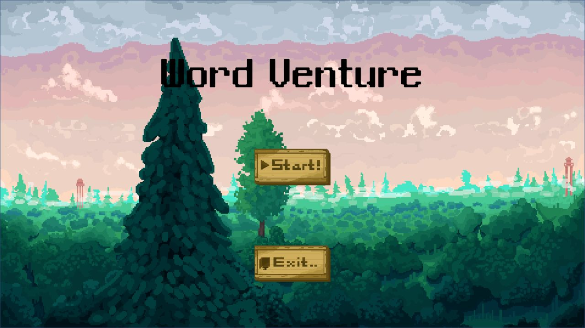
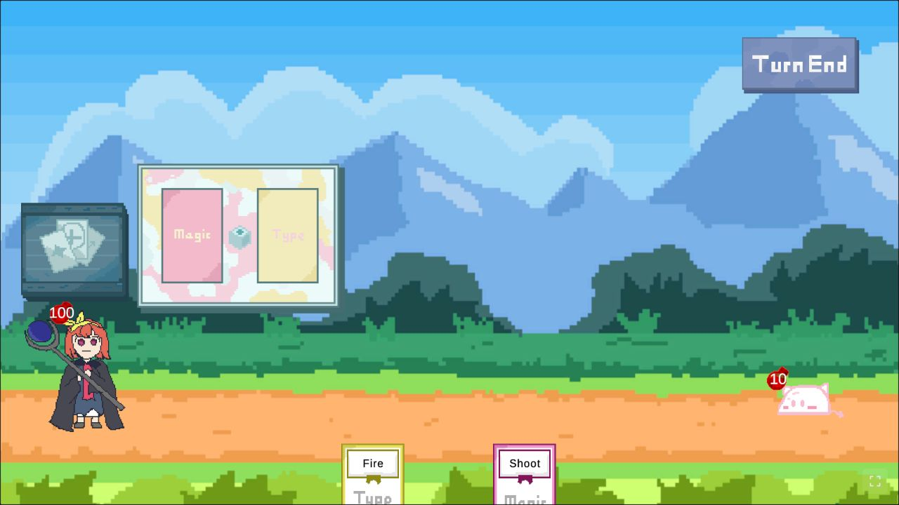

# WordVenture · 워드의 모험

**마법 카드와 속성 카드를 조합해 싸우는 2D 턴제 전투 게임.**

Team 6203의 GIGDC 2024 출품작입니다.

[다운로드 / 웹 플레이 안내](https://github.com/Apptive-Game-Team/WordVenture/releases) · [기여 가이드](CONTRIBUTING.md)

<table>
  <tr>
    <td width="50%"></td>
    <td width="50%"></td>
  </tr>
  <tr>
    <td align="center">타이틀</td>
    <td align="center">카드 조합 · 턴제 전투</td>
  </tr>
</table>

## 플레이

마우스 클릭과 드래그로 조작합니다.

1. 조합창에 마법 카드와 속성 카드를 놓습니다.
2. 조합을 실행하고 마법의 대상을 선택합니다.
3. 행동을 마치면 **Turn End**로 턴을 넘깁니다.

속성 상성을 활용해 스테이지를 진행하세요. 튜토리얼과 이어하기를 지원합니다.

## 개발 실행

Unity **2022.3.34f1**에서 프로젝트를 열고 `Assets/Scenes/TitleScene.unity`를 실행합니다.
자세한 설정과 테스트 방법은 [기여 가이드](CONTRIBUTING.md#unity에서-프로젝트-열기)를 참고하세요.

## 제작진 · Team 6203

<table>
  <tr>
    <th align="center">문성필</th>
    <th align="center">김현진</th>
    <th align="center">정윤성</th>
    <th align="center">정진욱</th>
    <th align="center">황인섭</th>
  </tr>
  <tr>
    <td align="center"></td>
    <td align="center"></td>
    <td align="center"></td>
    <td align="center"></td>
    <td align="center"></td>
  </tr>
  <tr>
    <td align="center">개발자 <a href="https://github.com/Monolong">@Monolong</a></td>
    <td align="center">개발자 <a href="https://github.com/Gimlocal">@Gimlocal</a></td>
    <td align="center">개발자 <a href="https://github.com/dev-yunseong">@dev-yunseong</a></td>
    <td align="center">디자이너 / 개발자 <a href="https://github.com/Jinwook700">@Jinwook700</a></td>
    <td align="center">개발자 <a href="https://github.com/hwanginseop">@hwanginseop</a></td>
  </tr>
</table>

### 아트 사용 안내

**이 게임에는 AI로 생성된 아트가 사용되었습니다.**
